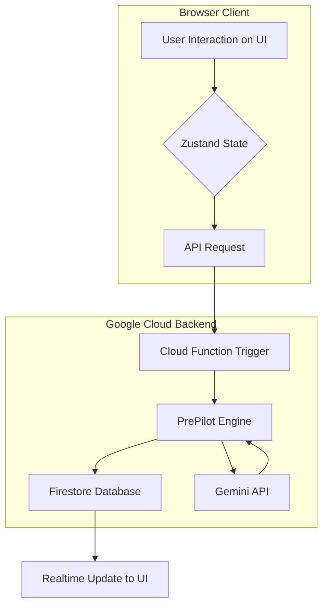

### **The Official Blueprint: PrePilot.Cloud - Architectural & Functional Specification v1.0**

```markdown
# Blueprint: PrePilot.Cloud - Architectural & Functional Specification v1.0

**Document Status:** Official | **Version:** 1.0 | **Lead Architect:** AI Staff Engineer

## 1.0 Executive Summary & Core Philosophy

### 1.1 Mission Statement
PrePilot.Cloud is a world-class, AI-powered SaaS application designed to eliminate guesswork in paid advertising campaign planning. It serves as a strategic co-pilot for marketers and founders, transforming simple user inputs into realistic, data-driven, and shareable campaign forecasts, specifically optimized for the Saudi Arabian & GCC markets.

### 1.2 Core Philosophy: "The Hybrid Brain"
The application's architecture is built on a "Hybrid Brain" model, strictly separating deterministic calculations from AI-driven narrative generation.
*   **The deterministic core (The "Left Brain"):** A multi-stage calculation engine that uses proprietary benchmarks and financial models to produce realistic, repeatable numerical forecasts. **This core is the source of all KPIs.**
*   **The AI layer (The "Right Brain"):** A sophisticated AI orchestration layer (using Google Gemini) that takes the final, validated numbers from the core and enriches them with strategic narrative, explanations, and actionable recommendations in a culturally relevant Saudi dialect.

## 2.0 System Architecture Overview

The application follows a modern, cloud-native, serverless architecture.

### 2.1 Technology Stack
*   **Frontend:** Vite, React 18+, TypeScript, Tailwind CSS, Zustand (State Management), Framer Motion (Animation).
*   **Backend (Serverless):** Google Firebase Suite.
    *   **Authentication:** Firebase Authentication (Email/Password, Google OAuth).
    *   **Database:** Firestore (for user data, campaign plans, and workflow tasks).
    *   **Compute:** Cloud Functions for Firebase (for the core engine, async exports, and API integrations).
    *   **Storage:** Cloud Storage for Firebase (for storing generated assets like PDFs, XLSX files).
*   **AI Provider:** Google Gemini API (via `@google/genai`).
*   **Payments:** Stripe API.

### 2.2 Architectural Layers & Data Flow
The system is designed with a clear separation of concerns, illustrated by the following data flow:

`UI (React Components) -> State (Zustand) -> API Layer (Cloud Functions) -> PrePilot Engine -> Firestore (DB)`



## 3.0 Core User Journey & Page Architecture

The application is a Single Page Application (SPA) orchestrated by a central `App.tsx` component, managing the flow between the following key pages:

1.  **`HomePage`:** The marketing and landing page.
2.  **`AuthPages`:** (Login, Signup, Forgot Password).
3.  **`PlaygroundPage`:** The primary user input interface.
4.  **`ProcessingPage`:** The engaging waiting screen.
5.  **`ResultsDashboard`:** The main value delivery page, displaying the complete campaign report.
6.  **`ExportCenterPage`:** The hub for managing asynchronous export and publishing tasks.

## 4.0 The PrePilot Engine: Detailed Mechanics

The engine is a server-side Cloud Function that executes a precise, multi-stage pipeline.

### 4.1 Engine Pipeline
1.  **Input Validation:** Validates `CampaignData` against business rules (min budget, platform compatibility, season conflicts).
2.  **Budget Allocation:** Intelligently allocates the total budget across selected platforms using weighted industry splits (`industrySplits.ts`) and goal modifiers (`goalWeights.ts`). Includes a tactical reallocation step for high-competition scenarios.
3.  **Core KPI Calculation:** A deterministic process that calculates raw KPIs for each platform by applying a sequence of multipliers (Industry, Season, Creative, Competition, Targeting) to a base set of performance benchmarks. A `combineMultipliers` function with soft/hard caps prevents unrealistic results.
4.  **Guardrails & Clamping:** The raw KPIs are processed through a validation layer that clamps values to realistic min/max ranges defined per industry (`validationBenchmarks.ts`). This step detects and flags "anomalies".
5.  **Financial Reconciliation:** A critical final check that ensures the consistency of financial metrics by enforcing the **"Golden Identity": `ROAS ≈ AOV / CAC (±20% tolerance)`**.
6.  **AI Orchestration (`_generateAIReport`):** The final, validated numbers are packaged into a detailed payload and sent to the Gemini API via the `orchestratorPrompt`. The AI's role is **strictly limited to generating text and insights based on the numbers provided**, not calculating the numbers themselves.

### 4.2 Key AI Functions
*   **`runCampaign`:** The main engine orchestrator.
*   **`preflightValidation`:** Provides real-time tips to the user in the `PlaygroundPage`.
*   **`parsePromptWithAI`:** Powers the AI Chat input method.
*   **`generateStrategicSummary`, `generateRecommendations`, etc.:** Specialized AI functions for generating specific report sections.

## 5.0 The Export & Publishing Workflow System

This is an advanced, asynchronous system designed for scalability and reliability.

### 5.1 Architecture
*   **Trigger:** User initiates an export or publish action from the `ResultsDashboard` or `ExportCenterPage`.
*   **Queueing:** The request is **not** processed in the browser. It is added as a new task document to a `workflowTasks` collection in Firestore.
*   **Processing:** A Firestore-triggered Cloud Function (`onTaskCreate`) listens for new tasks. It picks up a task, executes the long-running operation (e.g., generating a PDF, calling a social media API), and updates the task's status in Firestore.
*   **Real-time Feedback:** The user's UI (`WorkflowQueuePanel.tsx`) has a real-time listener attached to the `workflowTasks` collection. It updates instantly to show progress (`pending` -> `in-progress` -> `completed`/`failed`).

### 5.2 Core Modules
*   **`queueManager.ts`:** Handles adding, retrying, and managing the lifecycle of tasks in Firestore.
*   **`statusTracker.ts`:** Provides hooks and utilities for the frontend to subscribe to real-time status updates.
*   **`exportShareWorkflow.ts`:** The main orchestrator within the Cloud Function that runs the specific export or share logic.

## 6.0 Frontend Architecture & Design System

### 6.1 Modularity
The UI is built on a foundation of small, reusable "primitive" components located in `src/components/ui/` (`Button`, `Card`, etc.). These are composed into larger, more complex "widget" components in `src/components/report/` and `src/components/export/`, which are finally assembled in the `src/pages/` components.

### 6.2 Design System
*   **Identity:** World-class, elegant minimalism with a proud Saudi identity.
*   **Typography:** The entire application uses the **'IBM Plex Sans Arabic'** font family. Hierarchy is established through size and weight, not color.
*   **Color System:** A dual-theme system is implemented via CSS custom properties and a `darkMode: 'class'` strategy in Tailwind CSS.
    *   **Light Mode:** White/light gray foundation with a vibrant **Pink/Rose** primary accent.
    *   **Dark Mode:** Deep **Navy Blue** foundation with a vibrant **Purple** primary accent.
*   **Iconography:** The `react-icons` library (primarily Feather `fi` set) is the **only** source for icons. **Emojis are strictly forbidden in the codebase.**

## 7.0 Database Schema (Firestore)

*   **`users`:** Stores user profile information, authentication UID, subscription status (`stripeCustomerId`, `planTier`), and settings.
*   **`campaignPlans`:** Stores each campaign created by a user. Each document contains the original `campaignData` input and the final `campaignReport` output.
*   **`workflowTasks`:** Acts as the queue. Each document represents an export/publish job and stores its `status`, `progress`, `resultUrl`, and any errors.

---
**End of Blueprint**
```